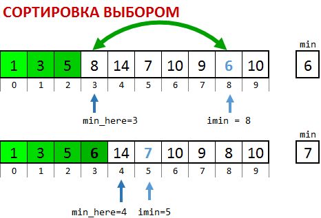

Функция `selection_sort`выбирает минимальный элемент среди неупорядоченных (на рисунке белые) и присоединяет его в конец упорядоченной части (на рисунке зеленые). Поэтому за первый проход алгоритма минимум массива ставится на первое место, за второй проход - второй по величине элемент ставится на второе место и т.д. Упорядоченная часть растет, не­упо­ря­до­ченная уменьшается по одному элементу за проход. Всего требуется N-1 проходов.


### Скопируйте список с заданиями в файл README.md в корне репозитория и вставляйте требуемые данные


1. Сперва мы сортируем один массив с фиксированными значениями. **Добавьте печать отсортированного массива после сортировки. Добавьте в код печать вашей фамилии.** Запустите программу и **вставьте скриншот** ее работы, на котором видна фамилия, сюда (в README.md в корне репозитория):\
 \
**Закомитьте исправления в коде, README.md, а также файл скриншота.**

2. Как выглядит массив после, например, третьего прохода? Откройте файл `selection_sort.cpp` и прочитайте комментарии. Индекс `min_here` показывает, куда сейчас надо ставить минимум. Нас интересует завершение прохода для `min_here`=2. **Вставьте соответствующий `if` с вызовом функции `print`в функцию `selection_sort`.**\
Запустите программу и **вставьте сюда скриншот** работы ОДНОГО запуска программы, на котором видна ваша фамилия и состояние массива РОВНО в три момента времени: 1) в начале, 2) после третьего прохода сортировки выбором, 3) после окончания сортировки:
 \
**Закомитьте исправления в коде, README.md, а также файл новый файл скриншота.**

3. Давайте вставим подсчет количества операций в функцию `selection_sort`. Будем считать наиболее часто повторяющиеся операции. В функции есть переменная `ops`.  \
**А.** Добавьте : 
- ее обнуление в начало программы; 
- ее увеличение на 1 при каждом выполнении `if`, возможно понадобится вставить фигурные скобки; 
- печать числа ops в самый конец функции `selection_sort`  

**Б.**Каков правильный ответ но числе операций? Цикл начинается со _второго_элемента неупорядоченной части, поэтому всего будет выполнено с 9 `if`-ов  в первом проходе, 8 во втором и т.д.… Проверьте себя. Когда будет готово, **вставьте**сюда **число операций, которое она печатает**(скриншот). \


**В.** **Зависит ли** число операций в ops от первоначального расположения чисел в массиве? (напишите ваш ответ):
\
**Закомитьте исправления в коде, README.md, а также файл новый файл скриншота. Делайте это в каждом задании**


4. Теперь займемся массивами побольше. Надо сделать так, чтобы массив генерировался случайно. Закомментируйте строки  `N=10; int A[] = { 5, 4, 1, 20, 7, 3, 6, 2, 8, 9 };` (не удаляйте, еще понадобится). Раскомментируйте две строки выше. Там программа спрашивает желаемое число элементов массива и динамически выделяет память под массив A из int, такого размера. Вставьте после этого цикл, который будет заполнять массив случайными числами от 1 до 10: \
```c
  for(int i = 0; i < N; ++i) { \
      A[i] = 1 + 9 * (1.0*rand()) /RAND_MAX; \
  }
```

Запустите программу несколько раз, вводя N=10. **Ответьте на вопрос** а) меняются ли числа в массиве? **Вставьте в начало программы srand(time(0));**  \
**Ответьте на вопросы**, б) меняются ли числа в массиве теперь. в) почему?

    а) Меняются ли без srand? 
    б) Меняются ли после srand?
    в) Почему?

5. Измените формулу  
    ```c
      A[i] = 1 + 9 * (1.0*rand()) /RAND_MAX;
    ```  
так, чтобы массив заполнялся случайными числами  от 0 до 20. Позапускайте  программу с N=20 несколько раз, добейтесь, чтобы в массиве были элементы 0 и 20. **Вставьте скриншот**, где видно работу программы, и видны элементы 0 и 20 в массиве. **Вставьте полученную формулу**.

6. Перейдем к действительно большим массивам. Добавим печать времени и уберем печать элементов массива. Закомментируйте вызовы print(A,N). Добавьте cтроку `t0 = clock();` перед сортировкой и строку `t1 = clock();` сразу после сортировки. Разность этих значений даст время, потраченное на сортировку. Вставьте скриншот работы программы для N=15000, на котором видна ваша фамилия и строка Finished, time=...ms.

7. Запустите программу 8 раз, по 2 раза для каждого значения  и **заполните следующую таблицу (если какое-то N дает время 0ms, увеличьте его значение, а также N в последующих строках так, чтобы в каждой строке N было больше предыдущего значения N в два раза).**

**Производительность сортировки выбором**
|N    | Время первого запуска, мс | Число операций в первом запуске | Время второго запуска, мс | Число операций в втором запуске|
|-----|------|------|------|------|
| 8000|      |      |      |      |
|16000|      |      |      |      |
|32000|      |      |      |      |
|64000|      |      |      |      |

Также вставьте скрин последнего запуска:
