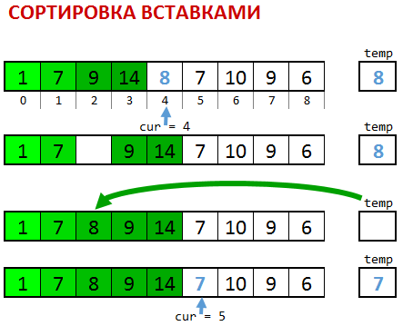

**Замените вызов `selection_sort` на `insertion_sort`**

Функция `insertion_sort` выбирает первый элемент неупорядоченной части и находит ему правильное место в упорядоченной части, сдвигая элементы вправо, если надо, чтобы освободить ему место.  Упорядоченная часть растет, неупорядоченная уменьшается по одному элементу за проход. Всего требуется _N_ проходов.

8. Снова прочитайте комментарии к `selection_sort`. Там описывается инвариант этой функции. **Какой инвариант** сохраняется после каждого прохода  **insertion_sort**?

9. Добавьте подсчет числа операций в переменной `ops` в `insertion_sort`, так же как в задании 3. Поскольку здесь два цикла: один ищет место, а второй освобождает его, строку `ops++;` надо добавить в каждый. Запустите программу несколько раз при одном и том же N=10. **Меняется ли число операций?**Верните печать несортированного и сортированного массива, **вставьте скриншот(ы) работы** программы, на которых видно массив и число операций.

10. Количество операций складывается из поиска от начала упорядоченной части и сдвига всех элементов от нужного места до конца упорядоченной части. Поэтому если мы найдем элемент близко к началу, то нам понадобится сдвинуть почти все элементы. Наоборот если мы долго будем искать правильное место и найдем его только в самом конце, почти не понадобится сдвигать элементы. Давайте искать с конца упорядоченной части и по ходу дела сразу сдвигать элементы на один вправо. Замените код функции `insertion_sort` на следующий:

  ```c
    ops = 0;
    for (cur = 1; cur < N; cur++) {
        temp = A[cur];
        here = cur;
        while (here>0 && A[here] >= temp) {
               ops++;
              A[here] = A[here-1];
                  here--;
        }
        A[here] = temp;
    }
    std::cout << ops << " operations\n";
  ```

Меняется ли число операций для одного и того же N теперь?

Запустите полученную программу 6 раз, по 2 раза для каждого значения  и **заполните следующую таблицу (изменяйте N в зависимости от производительности вашей машины, аналогично заданию 7):**


<table>
  <tr>
   <td>
<strong>insertion_sort</strong>
<p>
N \

   </td>
   <td>Время первого запуска, мс
   </td>
   <td>Число операций \
в первом запуске
   </td>
   <td>Время второго запуска, мс
   </td>
   <td>Число операций \
во втором запуске
   </td>
  </tr>
  <tr>
   <td>16000
   </td>
   <td>
   </td>
   <td>
   </td>
   <td>
   </td>
   <td>
   </td>
  </tr>
  <tr>
   <td>32000
   </td>
   <td>
   </td>
   <td>
   </td>
   <td>
   </td>
   <td>
   </td>
  </tr>
  <tr>
   <td>64000
   </td>
   <td>
   </td>
   <td>
   </td>
   <td>
   </td>
   <td>
   </td>
  </tr>
</table>


11. а) Зачем нужно проверять `here>0` в условии цикла `while`?  \
б) Приведите пример, когда без него получается неверный результат.

        а) Чтобы....
        б) Для массива 


