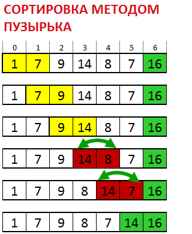

**Замените вызов insertion_sort на bubble_sort**

12. КОД bubble_sort СОДЕРЖИТ ОШИБКУ. Временно верните фиксированный массив из 10 элементов и печать отсортированного массива, **УСТРАНИТЕ ОШИБКУ**. \
Вставьте изменение и печать числа операций в bubble_sort. **Ответьте на вопрос**, зачем нужна строка `if (!obmen) break;` и приведите пример массива, и значения переменной `i`, для которых условие выполняется и происходит `break`.

13. Запустите полученную программу 6 раз, по 2 раза для каждого значения  и **заполните следующую таблицу (**изменяйте N в зависимости от производительности вашей машины, аналогично заданию 7**):**

<table>
  <tr>
   <td>
<strong>bubble_sort</strong>

N \

   </td>
   <td>Время первого запуска, мс
   </td>
   <td>Число операций \
в первом запуске
   </td>
   <td>Время второго запуска, мс
   </td>
   <td>Число операций \
во втором запуске
   </td>
  </tr>
  <tr>
   <td>16000
   </td>
   <td>
   </td>
   <td>
   </td>
   <td>
   </td>
   <td>
   </td>
  </tr>
  <tr>
   <td>32000
   </td>
   <td>
   </td>
   <td>
   </td>
   <td>
   </td>
   <td>
   </td>
  </tr>
  <tr>
   <td>64000
   </td>
   <td>
   </td>
   <td>
   </td>
   <td>
   </td>
   <td>
   </td>
  </tr>
</table>

 ** и вставьте скриншот последнего запуска (второго для макс. значения N)**

14. Сравните три таблицы, напишите, **как ведет себя время** с ростом N (логарифмически, линейно, логлинейно, квадратично, кубически, экспоненциально и т.д.). **Какой из трех** рассмотренных алгоритмов вел себя **лучше,** по вашему мнению, и почему? 
