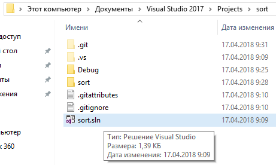
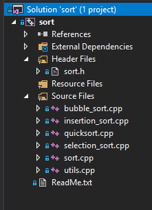

**Лабораторная работа № 6**

## Алгоритмы сортировки

**По этой лабораторной работе нужно сдать отчет в виде четырех файлов:**
- [`1selection.md`](./1selection.md)
- [`2insertion.md`](./2insertion.md)
- [`3bubble.md`](./3bubble.md)
- [`4quick.md`](./4quick.md)

Это файлы в широко используемом формате разметки Markdown. 

Цель работы - изучить алгоритмы сортировки. Для этого у нас в репозитории готов проект, в котором реализованы некоторые из них.

Откройте папку репозитория в Проводнике и откройте sort.sln: \

Проект разделен на части, так что каждая функция сортировки находится в отдельном файле с соответствующим именем, а файл [`utils.cpp`](./sort/utils.cpp) содержит функции `swap` и `print`. Заголовочный файл [`sort.h`](./sort/sort.h) содержит объявления всех функций, чтобы их можно было использовать в главной функции main() в [`sort.cpp`](./sort/sort.cpp).\

О сортировке пузырьком и вставками можно посмотреть следующее [видео из курса CS50](https://www.youtube.com/watch?v=D1u3H9_wmUU). Забавные иллюстрации к алгоритмам сортировки (и не только) можно посмотреть на канале
[AlgoRythmics](https://www.youtube.com/user/AlgoRythmics/videos)

В лабораторной работе 18 заданий, разделенных на 4 части.
